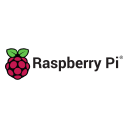
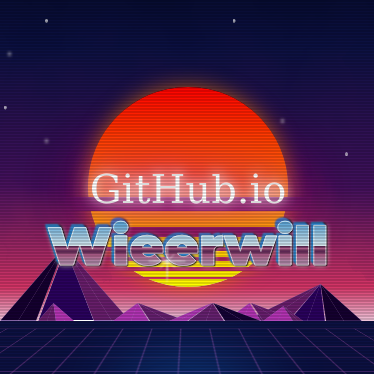

# Hi, I'm WieErWill
### Social Robotics and Machine Learning DEV from Germany
### Hobby Photographer in Wildlife and Nature
---

# Languages & Frameworks
 
 
 
 
 
 
 

 
 
 
 
 

# Databases
 
 
 
 
 

# Dev Tools
 
 
 
 
 
 
 
 
 
 
 
 
 
 

 
 
 
 

# Other Tools
 
 
 
 
 
 
 
 
 
 
 
 
 

 
 
 
 
 

# Github Stats

(Most used languages excludes some non-programming "languages" like TeX, HTML, CSS,...)

# My Projects at TU Ilmenau
 

# Hobby Projects
 
)

And many more projects on my GitHub Page

# Visit me to learn more about me

 
 

